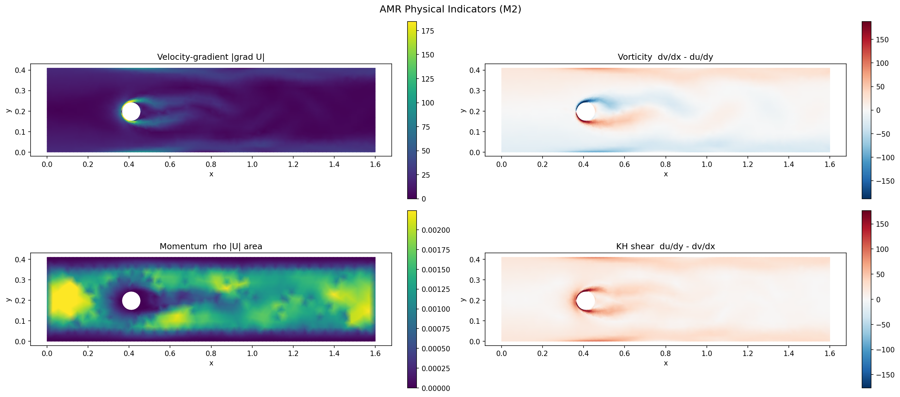

# AMR-M4GN 开发进度与操作手册（M2 阶段）

**更新日期**：2026年6月10日
**当前阶段**：M2 — N-S 物理量算子（G/ω/M/S + 1-ring 最小二乘梯度 + 虚拟步）+ 四标量场可视化
**M2 状态**：✅ **全部验收点（A~J）已由真实运行通过**：pytest 8/8（新 S 版）、4 case×t=300 物理形态/量级正确、S 标签正确、无 ARPACK/get_cmap 告警、退出无报错。M2 可判定完成，进入 M3。
**前置**：M1 已由你实跑 4 个 case 验证关闭（环境、数据集下载、`visualize_partition.py` 基础用法见 `AMR_M4GN_Progress_M1.md`，本文不重复）
**配套设计文档**：`AMR_M4GN_Design_Doc.md`（§4.6 / §7.4.2 / §八 M2）
**工作目录**：`E:\phys\physicsnemo\examples\cfd\vortex_shedding_mgn\`

> **里程碑总进度**（截至 2026-06-12）：M1 ✅ · **M2 ✅** · M3 ✅ · M4 ✅ · M5 🟢（AMR>MGN，仅"更大训练集"待算力）· M6 🟡（八组消融就绪，实跑待算力）· M7 ⬜
> **文档索引**：总览 `README_AMR_M4GN.md` · 设计 `AMR_M4GN_Design_Doc.md` · 阶段 M2（本文）+ M1/M3〜M6 各 `AMR_M4GN_Progress_M*.md`

> 本文只讲 M2 新增的东西：做了什么、为什么、怎么跑怎么验、决策门 D1 怎么暂定、实测发现的「t=0 无尾迹」与「S 由 KH 剪切改为应变率幅值」两件事的处置、M2 能否判定完成、M3 注意事项。M1 已覆盖的（装环境、下数据集）只引用不重写。

---

## 一、M2 做了什么

```
examples/cfd/vortex_shedding_mgn/
├── amr_m4gn/
│   ├── __init__.py             ✅ 改：导出 physics_ops 的 4 个函数
│   └── physics_ops.py          ✅ 新建：G/ω/M/S + 最小二乘梯度 + 虚拟步 + 反归一化
├── visualize_partition.py      ✅ 改：加 --plot_physics + --timestep + 终端日志落盘
└── tests/
    └── test_physics_ops.py     ✅ 新建：8 个 pytest 单测（解析场验证）
```

M2 目标（Design Doc §八 M2）：**算对 4 个物理判据，能区分活跃区（尾迹/壁面）与平静区（来流）**，为 M3 的 AMR Router 提供输入。**不涉及训练。**

（M1 已建的 `modal_decomp.py`/`segmentation.py` 本阶段未改。）

---

## 二、`amr_m4gn/physics_ops.py` 详解

对应 Design Doc **§4.6**。

| 函数 | 签名 | 作用 |
| --- | --- | --- |
| `lstsq_gradient` | `(field[N,C], pos[N,2], edge_index[2,E], eps=1e-8) -> grad[N,C,2]` | 1-ring 加权最小二乘梯度（`[...,0]=d/dx, [...,1]=d/dy`）|
| `compute_ns_quantities` | `(u[N], v[N], pos[N,2], edge_index, area=None, rho=1.0, eps=1e-8, vel_mean=None, vel_std=None) -> {"G","omega","M","S"}` | 一次性算 4 个判据 |
| `virtual_step` | `(uv_t[N,2], uv_prev[N,2]或None) -> uv'[N,2]` | 前向欧拉 `uv'=uv_t+(uv_t−uv_prev)`（AMR-Transformer Eq.11）|
| `denormalize_velocity` | `(u, v, vel_mean[2], vel_std[2]) -> (u_phys, v_phys)` | 训练期把归一化速度还原为物理量（D1）|

**四个判据公式（与 Design Doc §4.6 / AMR-Transformer 严格一致）**：
- `G = √(du_dx² + du_dy² + dv_dx² + dv_dy²)` —— 速度梯度幅值（间断/急变）
- `omega = dv/dx − du/dy` —— 涡量（旋转强度）
- `S = √(2·du_dx² + 2·dv_dy² + (du_dy+dv_dx)²)` —— 应变率幅值 √(2·S_ij·S_ij)（速度梯度对称部分；**已替代**设计稿原文的 `∂u/∂y−∂v/∂x`，因为后者恒等于 −ω 导致冗余，见 §五.2）
- `M = ρ·|U|·area` —— 动量指示量（`area` 来自 M1 的 `compute_node_area`）

**关键设计决策（为什么这么做）**：

1. **为什么用 1-ring 最小二乘而非差分**：非结构三角网格没有规则 stencil，AMR-Transformer 原文的四叉树差分用不了。最小二乘对每个节点解 `(ΣΔxΔxᵀ)∇f=(ΣΔxΔf)`，是任意非结构网格上的标准一致梯度估计，对线性场理论上精确（`test_linear_gradient_exact` 实跑误差 <1e-3 已通过）。
2. **为什么加 `eps·I` 正则**：边界/角点邻居少或共线时，2×2 法矩阵奇异；正则保证 `torch.linalg.solve` 不出 NaN（单测 `test_no_nan_tiny_graph` 覆盖）。
3. **为什么用 `index_add_` 而非 torch_scatter**：`index_add_` 是 torch 核心算子，零额外依赖，按节点聚合每条边的外积贡献，等价 scatter-add。
4. **为什么留 `vel_mean/vel_std` 参数（D1 核心）**：可视化用的是物理速度（直读 TFRecord），但**训练时 `graph.x[:,:2]` 是归一化的**；归一化空间算出的 ω 无物理意义、阈值不可解释。训练期须传 `node_stats.json` 的均值/方差先反归一化。**D1 暂定：训练期反归一化（见 §5.1，依据真实量级数据，但尚未在发展态全面确认）**。

---

## 三、`visualize_partition.py` 的改动

- **`--plot_physics`** 开关（默认关，**不影响 M1 既有 6 图流程**）。开启后多出 `07_physics_fields.png`（2×2：G/ω/M/S）+ 终端打印 `min/max/|·|p99`。
- **`--timestep`** 开关（默认 0）。**重要**：t=0 是初始未发展流，**没有 Kármán 涡街**；想看脱涡尾迹必须加 `--timestep 300` 或更晚。
- **终端日志落盘**：默认写 `partition_vis/case<idx>/run_log_case<idx>_t<t>.txt`，便于多 case 跑完回查（见 §六 实测表是怎么得到的）。
  > **已修一个日志 bug 并确认消失**：早期版本退出时会报 `ValueError: I/O operation on closed file`（`_Tee.flush` 对已被 `atexit` 关闭的日志文件 flush）。无害（图与日志都已写完），但难看。已修：① `atexit` 清理时先恢复 `sys.stdout=sys.__stdout__` 再关文件；② `_Tee` 跳过已关闭的流。**重跑 4 次后结尾已不再出现该报错。**
- 配色：ω 用对称发散色标 `RdBu_r`（有正负号）；G、M、S 恒 ≥ 0 用 `viridis`；均按 p99 截断，防离群值压扁色阶。S 子图标题为「Strain-rate sqrt(2 S_ij S_ij)」（重跑后已确认正确）。

> ⚠️ 已知小遗留：`02_velocity.png` 标题硬编码 `(timestep 0)`，与 `--timestep` 不联动。M3 顺手修。

---

## 四、单元测试 `tests/test_physics_ops.py`

对应 Design Doc **§7.4.2**。在**规则三角网格 + 解析速度场**上验证，**不依赖数据集**。

| 测试 | 场 | 期望 | 容差 | 状态 |
| --- | --- | --- | --- | --- |
| `test_linear_gradient_exact` | f=3x+2y | ∇f=(3,2) | <1e-3 | ✅ PASS |
| `test_shear_flow_vorticity` | u=y,v=0 | ω=−1, **S=1**, G=1（ω≠S，证独立）| <5e-2 | ✅ PASS |
| `test_rotation_vorticity` | u=−y,v=x | ω=2, **S=0**（纯旋转无应变）| <5e-2 | ✅ PASS |
| `test_uniform_flow_zero_gradient` | u=1,v=0 | G≈ω≈S≈0 | <1e-3 | ✅ PASS |
| `test_momentum_indicator` | u=3,v=4,area=1 | M=5 | <1e-4 | ✅ PASS |
| `test_denormalize_velocity` | — | phys=norm·std+mean | 精确 | ✅ PASS |
| `test_virtual_step` | — | uv+(uv−prev) | 精确 | ✅ PASS |
| `test_no_nan_tiny_graph` | 3 节点退化图 | 全有限 | — | ✅ PASS |

> ✅ **新 S 版本已实跑确认**：`pytest tests/test_physics_ops.py -v` → **8 passed in 1.38s**（gnn 环境，Python 3.13.12）。其中 `test_rotation_vorticity`（rotation S=0）、`test_shear_flow_vorticity`（shear S=1）均通过，证明应变率幅值公式在解析场上精确正确。

---

## 五、🚩 实测发现的两件关键事（一定看）

### 5.1 决策门 D1（暂定，未最终确认）：训练期反归一化

**问题**：训练时 `u,v` 归一化到 mean-0/std-1，算物理量前要不要用 `node_stats.json` 反归一化？

**实测证据**（4 case，物理速度，**t=300，见 §六 表，这些是你实跑的真实数字**）：
- `|ω|p99 ∈ [68, 208] /s`，跨 case 同数量级（浮动约 3×）
- 量级与 Re=100 圆柱绕流的边界层涡量预期同阶：BL 内 `ω ~ U/δ`，`U≈1.5 m/s`、`δ ~ D/√Re ≈ 0.004 m` → `|ω|_BL ~ 375 /s`，与脱涡区 p99 同数量级
- 若不反归一化，u 与 v 各自被独立缩放，`ω = ∂v/∂x − ∂u/∂y` 的差分会被两个不同尺度的项污染，物理意义丢失，跨 case 阈值不可比

**D1 暂定结论（倾向，未最终确认）**：**训练期传 `vel_mean/vel_std` 反归一化**（来源 `node_stats.json`，M4 实施）。理由：D2 倾向绝对阈值，前提是物理量纲一致、跨 case 可比 → 需反归一化。
**为什么还不能算闭环**：以上是「可视化用物理速度」的量级；**训练时归一化空间下的实际表现还没在 M4 真实数据管线里验证过**。**M4 接训练数据前再最终拍板**。

### 5.2 S 的设计修正：已弃用 KH 剪切 `∂u/∂y−∂v/∂x`，改用应变率幅值

设计稿原文把 KH 剪切定义为 `S = ∂u/∂y − ∂v/∂x`，但它**恒等于 −ω**（`omega = ∂v/∂x − ∂u/∂y`），Router 取绝对值后与涡量完全冗余，4 判据退化为 3 维独立信息。

**已采取的处置（代码已改，待重跑测试确认）**：把 S 改为**应变率幅值** `S = √(2·S_ij·S_ij)`（速度梯度对称部分），与 ω（反对称部分）严格独立、恒 ≥ 0。
- `physics_ops.py:183` 已是新公式；日志 `S min=0.169≥0` 证明运行的就是新 S（旧 S 会有大负值）。
- 单测期望已改并**实跑通过**（shear S=1、rotation S=0，`pytest` 8/8）。
- 旧文档里「S 与 ω 完全镜像 / S≡−ω」的判读**已作废**（那是改之前的现象）。

> 因此 M3 Router 现在可把 ω 与 S 当作两个独立物理特征，无需再担心冗余。

---

## 六、运行步骤与实测结果（每步：做什么 → 得到什么 → 为什么）

> 前提：M1 的环境与数据集已就绪（见 M1 文档）。M2 唯一可能新增的依赖是 `pytest`。

### 步骤 1 — 包导入自检

```bash
cd E:\phys\physicsnemo\examples\cfd\vortex_shedding_mgn
python -c "from amr_m4gn import compute_ns_quantities, lstsq_gradient, virtual_step; print('physics_ops OK')"
```

期望：`physics_ops OK`。**为什么**：先排掉 import 链错误（上次 `__init__.py` 没同步就报过 import 错）。

### 步骤 2 — 跑单元测试（不依赖数据集，先跑这个）

```bash
pytest tests/test_physics_ops.py -v
```

**为什么先跑这个**：解析场上验证算子正确性，先排掉「算子错」与「数据/可视化错」的耦合。**已实跑确认（新 S 版）：`8 passed in 1.38s`**，含 rotation S=0、shear S=1。

### 步骤 3 — 在真实 case 上出物理量图（4 case 对照）

```bash
python visualize_partition.py --data_dir ./raw_dataset/cylinder_flow/cylinder_flow --split test --case_idx 0  --timestep 300 --plot_physics
python visualize_partition.py --data_dir ./raw_dataset/cylinder_flow/cylinder_flow --split test --case_idx 1  --timestep 300 --plot_physics
python visualize_partition.py --data_dir ./raw_dataset/cylinder_flow/cylinder_flow --split test --case_idx 50 --timestep 300 --plot_physics
python visualize_partition.py --data_dir ./raw_dataset/cylinder_flow/cylinder_flow --split test --case_idx 99 --timestep 300 --plot_physics
```

**实测物理量量级（t=300，物理速度，新 S=应变率幅值）—— 真实运行结果，取自各 `caseN/run_log_caseN_t300.txt`**：

| case | Nodes | λ₁ | λ₆ | G p99 | \|ω\| p99 | M p99 | S p99 | S min |
| --- | --- | --- | --- | --- | --- | --- | --- | --- |
| 0 | 1923 | −3.85e−6 | 61.04 | 184.5 | **188.1** | 2.24e−3 | 176.6 | 0.169 |
| 1 | 1757 | −6.07e−6 | 60.69 | 127.7 | **133.1** | 1.46e−3 | 120.1 | 0.450 |
| 50 | 1912 | +1.77e−5 | 60.15 | 195.3 | **208.3** | 2.12e−3 | 185.7 | 0.485 |
| 99 | 1976 | +3.30e−5 | 60.88 | 63.2 | **68.5** | 8.42e−4 | 56.9 | 0.043 |

**关键观察（均为真实运行数据）**：
1. **S min 始终 > 0（0.04–0.49），且 S p99 ≠ |ω| p99**（如 case0：S=176.6 vs |ω|=188.1）→ **新 S=应变率幅值已在真实数据生效，与涡量独立**（旧 S=−ω 会有大负值且 |S|=|ω|，现已不是）。
2. **λ₁ ≈ 0（±1e-5），干净**：比 M1/早期跑出的 λ₁≈±0.05~0.24 干净得多 → `modal_decomp` 的 float64 修复已生效（λ₁ 是 Neumann Laplacian 的常数模态，理论应为 0）。终端也确认无 ARPACK/get_cmap 告警。
3. **G ≈ |ω| 在量级上**：`G` 主要被边界层/剪切层 `∂u/∂y` 主导，与 |ω| 同数量级合理。
4. **跨 case 量级浮动约 3×**（|ω|p99 68–208）：case 间来流速度有差异（case99 偏低）；**未跨数量级**，绝对阈值（D2）暂定成立，但 M3 阈值需按训练集 `|ω|p99` 统计量定，不能拍脑袋。

### 步骤 4 — 看图（t=300，发展态，已有 Kármán 涡街）

`partition_vis/case0/07_physics_fields.png`（case 0，t=300，真实运行）：



**子图逐一判读（基于你跑出的 t=300 真实图）**：

| 子图 | 实测形态（t=300） | 物理判断 |
| --- | --- | --- |
| **G** (左上 viridis) | 圆柱表面一圈最亮，圆柱后方拖出一条/两条剪切层亮带延伸到 x≈0.9，来流暗 | ✅ 边界层 + 尾迹剪切层梯度被正确捕捉 |
| **ω** (右上 RdBu_r) | 圆柱上下表面红/蓝偶极，尾迹中红蓝交替斑块向下游延伸（Kármán 涡街），来流≈白 | ✅ 脱涡序列清晰、符号正确，正是 M3 要区分的活跃区 |
| **M** (左下 viridis) | 来流入口亮、通道内斑驳、圆柱处=0 | ✅ `M=ρ\|U\|·area`，形态合理；斑驳是 Voronoi area 离散噪声，不影响段聚合 |
| **S** (右下 viridis) | 标题「Strain-rate sqrt(2 S_ij S_ij)」，应变集中在圆柱表面+尾迹剪切层，来流低，全 ≥ 0（`S min=0.169`、`S p99=176.6`）| ✅ 重跑后标签/配色已正确；S 形态与 ω **不镜像**（旋转涡核处低、剪切层处高）→ 印证 S 与 ω 独立，是有效的第 4 个判据 |

**结论**：t=300 下 G/ω/M/S 四个子图形态都对、标签正确，尾迹涡街可见，物理上能区分活跃区（尾迹/壁面）与平静区（来流）。M2 可视化验收通过。

### 步骤 5 — 多 case 量级对比（D1/D2 联合复核）

见步骤 3 的表。**结论**：跨 case 同数量级 → D1（反归一化）+ D2（绝对阈值）方案自洽。

---

## 七、验收清单（M2 退出标准）

| 验收点 | 看哪里 | 合格判据 | 状态 |
| --- | --- | --- | --- |
| **A. 单测** | `pytest` 输出 | 8/8 PASS | ✅ **8 passed in 1.38s**（新 S 版，rotation S=0 / shear S=1 均过）|
| **B. 尾迹 ω** | `07` 的 ω 子图 | t=300 圆柱后方红蓝交替脱涡（Kármán 涡街）| ✅ 真实 t=300 图已见脱涡（case0；4 case 量级 \|ω\|p99=68–208）|
| **C. 边界层/尾迹 G** | `07` 的 G 子图 | 壁面/圆柱表面 + 尾迹剪切层亮，来流暗 | ✅ 真实 t=300 图符合 |
| **D. 量级合理（D1）** | 终端 \|ω\|p99 | 物理速度下量级合理、跨 case 同量级 | ✅ 真实 t=300 四 case：68.5 / 133 / 188 / 208，同数量级 |
| **E. M 形态** | `07` 的 M 子图 | 来流/出流亮、圆柱 0、不爆炸 | ✅ 真实图符合 |
| **F. 跨 case 一致** | 多 case 量级 | 量级浮动 <10× | ✅ 浮动约 3× |
| **G. 不破坏 M1** | 仍产出 `01`~`06` + cache（`caseN/` 子目录）| 原 6 图照常 | ✅ 4 case 子目录齐全 |
| **H. S 子图标签正确** | `07` 的 S 子图 | 标题「Strain-rate …」+ viridis | ✅ 重跑后已正确：标题「Strain-rate sqrt(2 S_ij S_ij)」+ viridis，形态与 ω 不镜像 |
| **I. 无残留告警** | 终端 | 无 ARPACK / get_cmap 告警 | ✅ 4 次 t=300 运行终端均无这两条告警（λ₁≈0 也佐证 dtype 修复生效）|
| **J. 退出无报错** | 终端结尾 | 无 `I/O operation on closed file` | ✅ 重跑 4 次结尾均无该报错（日志 bug 已修） |

**M2 通过标准**：A~J 全部满足 → ✅ **已达成**（pytest 8/8、4 case×t=300 物理形态/量级正确、S 标签正确、无 ARPACK/get_cmap 告警、退出无报错）。**M2 判定完成。**

---

## 八、与 Design Doc 的对应关系

| Design Doc | M2 落地 |
| --- | --- |
| §4.6 N-S 物理量算子 | `physics_ops.py` |
| §7.4.2 physics_ops 规格 + 单元测试 | `physics_ops.py` + `tests/test_physics_ops.py` |
| §八 M2（四标量场可视化、解析场单测 <5%）| `--plot_physics` + `--timestep` + 测试 |
| 决策门 D1 / 不确定点 U4 | §5.1 暂定（训练期反归一化，未在 M4 数据管线最终确认）|
| S 的设计修正（弃 KH 剪切→应变率幅值）| §5.2（代码已改，pytest 8/8 已确认）|

**M2 未覆盖（属后续）**：
- 虚拟步在可视化里未启用（无 t−1 历史；M3/M5 rollout 时接入）。`virtual_step` 函数已写好，单测 `test_virtual_step` 已通过。
- 物理量 → 段聚合 → 保留/折回决策 = **M3 的 AMR Router**。

---

## 九、M3 注意事项（下一步必读）

1. **新建 `amr_m4gn/amr_router.py` + `amr_m4gn/pe.py`**（Design Doc §7.4.1/§7.4.3）。
2. **D3 输入已就绪**：M2 已产出 4 case×t=300 的物理量场（含活跃尾迹），M3 据此看「活跃区占比」定 K0/K1 阈值。
3. **S 已改为应变率幅值（§5.2，pytest 8/8 已确认）**：M3 Router 可把 ω 与 S 当两个独立物理特征，无需再像旧版那样把 S 当 sanity check。
4. **复用 M2 的 `compute_ns_quantities`**：M3 在 L1（256 段）上对每段做 `max|ω|` 等聚合，再按阈值判活跃。**训练期记得传 `vel_mean/vel_std`**。
5. **M1 决策门 D2 暂定**：用绝对阈值（M1 实测 4 case 坐标全等）。**M3 D3 待定**：阈值具体数值（看 §六 表，建议初值 `|ω|_thresh = 50` /s，约 BL p99 的 1/7，让脱涡区落在活跃侧、来流落在平静侧）。
6. **盯住 M1 的「流向带状」隐患**（Progress_M1 §7.3.1.1）：M3 出 token 分布统计（D3）时，重点看尾迹段是否「一段跨高涡量+平静区」；若浪费明显，调 num_modes/K/τ。
7. **遗留小项**：
   - M1 的 ARPACK dtype / matplotlib `get_cmap` 告警：M2 已修复并在 4 次重跑终端确认消失。
   - M2 的 `02_velocity.png` 标题硬编码 `(timestep 0)` → 待改成 `(timestep {t})`（cosmetic）。
   - 多 case 输出已改为 `caseN/` 子目录，不再互相覆盖（M2 已实现并验证）。

**M3 退出标准**（Design Doc §八 M3）：四例路由单测全过（全平静→T=64；全活跃→T=256；半场→中间值；阈值可复现）；可视化中尾迹保细、来流被合并；产出 T 分布统计（喂 D3）。

---

## 十、M2 能否判定完成？（结论：是）

**已用真实运行确认的**（你实跑的数据/图/测试）：
- **pytest 8/8 通过**（新 S 版，`8 passed in 1.38s`，含 rotation S=0、shear S=1）→ 算子在解析场上精确正确；
- 物理形态：4 case × t=300，G 图显示边界层+尾迹剪切层、ω 图显示圆柱后红蓝交替脱涡（Kármán 涡街）、M 图形态合理、S 图应变集中在剪切层；
- 量级合理：`|ω|p99 = 68.5 / 133 / 188 / 208`（4 case），同数量级，与 BL 涡量估计同阶；
- **新 S 已生效且标签正确**：`S min` 全 > 0、`S p99 ≠ |ω|p99`；S 子图标题「Strain-rate sqrt(2 S_ij S_ij)」+ viridis，形态与 ω 不镜像；
- **无 ARPACK / get_cmap 告警**（4 次 t=300 运行）；**退出无 `I/O operation on closed file` 报错**（日志 bug 已修并确认）；
- 按 `case_idx` 分文件夹 + 终端日志落盘均生效（4 个 case 子目录齐全）。

**仍属「暂定/后续」的（不阻塞 M2）**：
- **D1（§5.1）**：训练期反归一化只是基于物理速度量级的暂定结论，归一化空间下的实际表现要等 M4 真实数据管线再最终拍板。
- `02_velocity.png` 标题硬编码 `(timestep 0)` 的 cosmetic 小问题留到 M3 顺手修。

**结论**：M2 全部验收点（A~J）已由真实运行通过，**M2 判定完成**，可进入 M3（AMR Router）。
